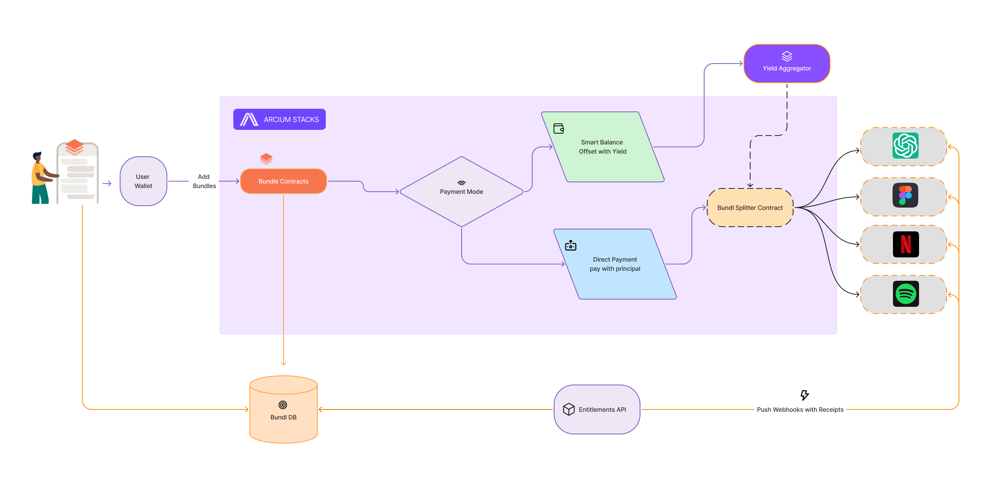
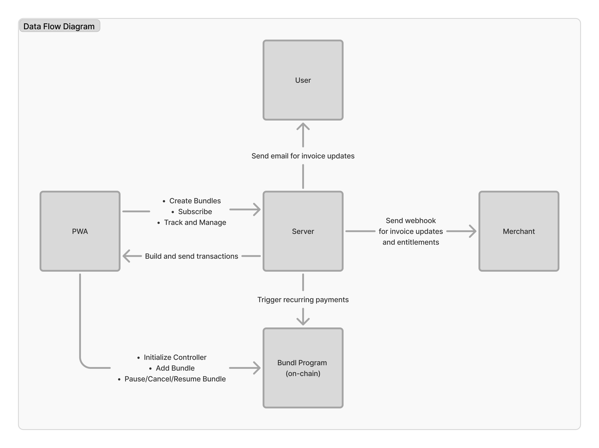
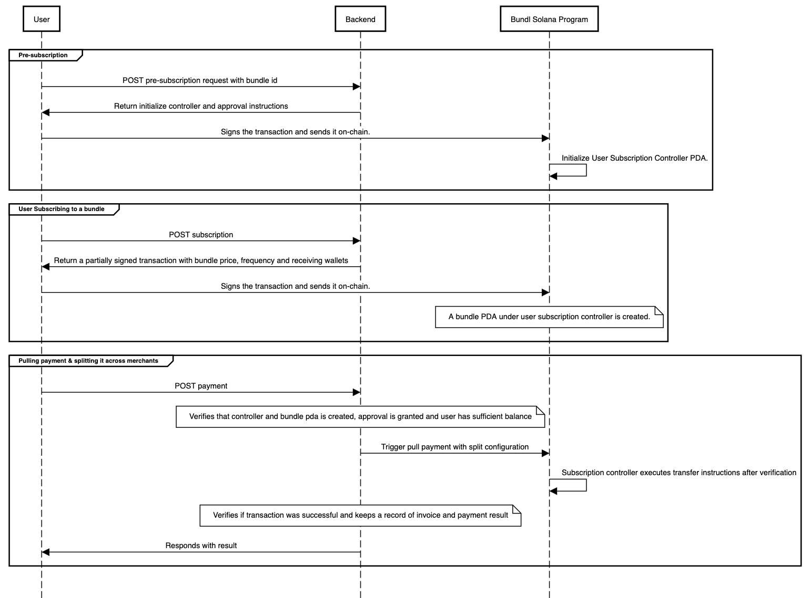

# Bundl Subs

  

**One payment. All your subscriptions. Powered by stablecoins.** No more random billing dates, surprise charges or failed payments.

<a href="https://arena.colosseum.org/projects/explore/bundl" target="blank"><svg style="width:22px; padding-right: 6px;" viewBox="0 0 32 32" fill="none" xmlns="http://www.w3.org/2000/svg"><rect width="32" height="32" fill="black" rx="16" /><path d="M26.5574 6.73698H5.78781V9.26779H26.5574V6.73698Z" fill="white"></path><path d="M24.5038 11.2324H7.83915V13.7632H24.5038V11.2324Z" fill="#ECECEC"></path><path d="M17.4347 15.7284H14.9039V26.8419H17.4347V15.7284Z" fill="white"></path><path d="M12.3767 15.7284H9.84585V26.8419H12.3767V15.7284Z" fill="white"></path><path d="M22.5017 15.7284H19.9708V26.8419H22.5017V15.7284Z" fill="white"></path></svg></a>

## 🚀 Project Overview

**Bundl Subs** helps you fund and manage all your subscriptions in one place, unlocking exclusive discounts while offsetting costs with yield on idle assets.

Refer to the following submodules for their respective codebases: 
- **[Backend](backend/README.md)** (APIs and Cron Job)
- **[Frontend](frontend/README.md)** (PWA)
- **[Solana_Programs](solana-programs/README.md)** (Bundl program code and state)

> _Please see each submodule/directory for low-level implementation and API docs._

## 🧩 Product highlights

- **Bundle Creation/Discovery**: Users can create, discover, and subscribe to curated bundles
- **Secure Auto-Renewals**: Trust-minimized pull-based auto-renewing subscription payments on-chain
- **Exclusive deals and discounts**: Bundling creates stickiness, allowing merchants to offer exclusive discounts against reduces CAC.
- **Activity/Subscription Tracking**: Users track and manage one payment with an easy to use interface, can pause/resume or cancel anytime.

## ⚙️ How It Works

1. **User creates/discovers a bundle:** Server identifies the applicable offers from each choosen subscription and calculate their all-in monthly cost and bundle savings in real time.
1. **User deploys it's Subscription Controller:** A personalised controller will provide hassle-free pull-based auto-renewals while ensuring that the user only pays for bundles they have subscribed for.
1. **Backend pull payments every month:** Bundle server create invoices and pull payments for them in a trust-minimized fashion with split configuration.
1. **Merchants and users are communicated:** Every invoice creation and payment attempt is communicated to the merchants through webhook and to the users through email.
1. **User claim entitlements and enjoy their subscriptions:** Users can claim entitlement for a service included in their bundle in variety of ways, configurable on merchants side. An activation link on email, a form submission with dynamic fields or a merchant code

> _Sounds interesting? wanna dig deep? navigate to the relevant submodule to find lower level details and specifications._

## 🔗 Data Flow Diagram

## Subscription Activation Sequence Diagram

## 🛠️ Tech Stack

- **Frontend:** Next.js (React), TypeScript
- **Backend:** NestJS, TypeScript, MongoDB
- **Smart Contracts:** Rust, Anchor, Solana

## TODO / Missing Pieces
- [ ] Data Flow Chart (above)